[TOC]


# 硅谷小智（医疗版）

尚硅谷-环环

## 前置知识

- Java基础
- Maven
- MySQL

- SSM
- SpringBoot


## 一、LangChain4j 入门

### 1、简介

LangChain4j 的目标是简化将大语言模型（LLM - Large Language Model）集成到 Java 应用程序中的过程。


#### 1.1、历史背景

2022 年11月30日OpenAI发布了Chat GPT（GPT-3.5）

早在 2022 年10月，Harrison Chase 发布了基于Python的LangChain。

随后同时包含了Python版和JavaScript（LangChain.js）版的LangChain 也发布了。

2023 年 11 月，Quarkus 发布了 LangChain4j 的 0.1 版本，2025 年 2 月发布了 1.0 - Beta1 版本，4 月发布了 1.0 - Beta3 版本

**官网：**https://docs.langchain4j.dev


#### 1.2、主要功能

**与大型语言模型和向量数据库的便捷交互**

通过统一的应用程序编程接口（API），可以轻松访问所有主要的商业和开源大型语言模型以及向量数据库，使你能够构建聊天机器人、智能助手等应用。

**专为 Java 打造**

借助Spring Boot 集成，能够将大模型集成到ava 应用程序中。大型语言模型与 Java 之间实现了双向集成：你可以从 Java 中调用大型语言模型，同时也允许大型语言模型反过来调用你的 Java 代码

**智能代理、工具、检索增强生成（RAG）**

为常见的大语言模型操作提供了广泛的工具，涵盖从底层的提示词模板创建、聊天记忆管理和输出解析，到智能代理和检索增强生成等高级模式。


#### 1.3、应用示例

1. 你想要实现一个自定义的由人工智能驱动的聊天机器人，它可以访问你的数据，并按照你期望的方式运行：

   - 客户支持聊天机器人，它可以：

     - 礼貌地回答客户问题

  - 处理 / 更改 / 取消订单

   - 教育助手，它可以：

     - 教授各种学科
  - 解释不清楚的部分
    - 评估用户的理解 / 知识水平

2. 你想要处理大量的非结构化数据（文件、网页等），并从中提取结构化信息。例如：

   - 从客户评价和支持聊天记录中提取有效评价
   - 从竞争对手的网站上提取有趣的信息
   - 从求职者的简历中提取有效信息

3. 你想要生成信息，例如：

   - 为你的每个客户量身定制的电子邮件
   - 为你的应用程序 / 网站生成内容：
     - 博客文章
     - 故事

4. 你想要转换信息，例如：

   - 总结
   - 校对和改写
   - 翻译


### 2、创建SpringBoot项目

#### 2.1、创建一个Maven项目

java-ai-langchain4j

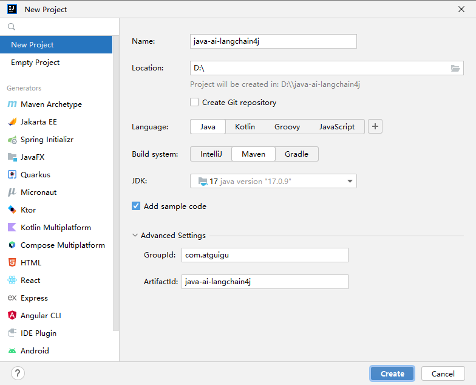

#### 2.2、添加SpringBoot相关依赖

在pom.xml的 <project> 节点下填加如下依赖

```xml
<properties>
    <maven.compiler.source>17</maven.compiler.source>
    <maven.compiler.target>17</maven.compiler.target>
    <project.build.sourceEncoding>UTF-8</project.build.sourceEncoding>
    <spring-boot.version>3.2.6</spring-boot.version>
    <knife4j.version>4.3.0</knife4j.version>
    <langchain4j.version>1.0.0-beta3</langchain4j.version>
    <mybatis-plus.version>3.5.11</mybatis-plus.version>
</properties>


<dependencies>
    <!-- web应用程序核心依赖 -->
    <dependency>
        <groupId>org.springframework.boot</groupId>
        <artifactId>spring-boot-starter-web</artifactId>
    </dependency>
    <!-- 编写和运行测试用例 -->
    <dependency>
        <groupId>org.springframework.boot</groupId>
        <artifactId>spring-boot-starter-test</artifactId>
        <scope>test</scope>
    </dependency>
    <!-- 前后端分离中的后端接口测试工具 -->
    <dependency>
        <groupId>com.github.xiaoymin</groupId>
        <artifactId>knife4j-openapi3-jakarta-spring-boot-starter</artifactId>
        <version>${knife4j.version}</version>
    </dependency>
</dependencies>

<dependencyManagement>
    <dependencies>
        <!--引入SpringBoot依赖管理清单-->
        <dependency>
            <groupId>org.springframework.boot</groupId>
            <artifactId>spring-boot-dependencies</artifactId>
            <version>${spring-boot.version}</version>
            <type>pom</type>
            <scope>import</scope>
        </dependency>
    </dependencies>
</dependencyManagement>
```

#### 2.3、创建配置文件

在resources下创建配置文件application.properties

```properties
# web服务访问端口
server.port=8080
```

#### 2.4、创建启动类

```java
package com.atguigu.java.ai.langchain4j;

import org.springframework.boot.SpringApplication;
import org.springframework.boot.autoconfigure.SpringBootApplication;

@SpringBootApplication
public class XiaozhiApp {
    public static void main(String[] args) {
        SpringApplication.run(XiaozhiApp.class, args);
    }
}
```

#### 2.5、启动启动类

访问 http://localhost:8080/doc.html 查看程序能否成功运行并显示如下页面

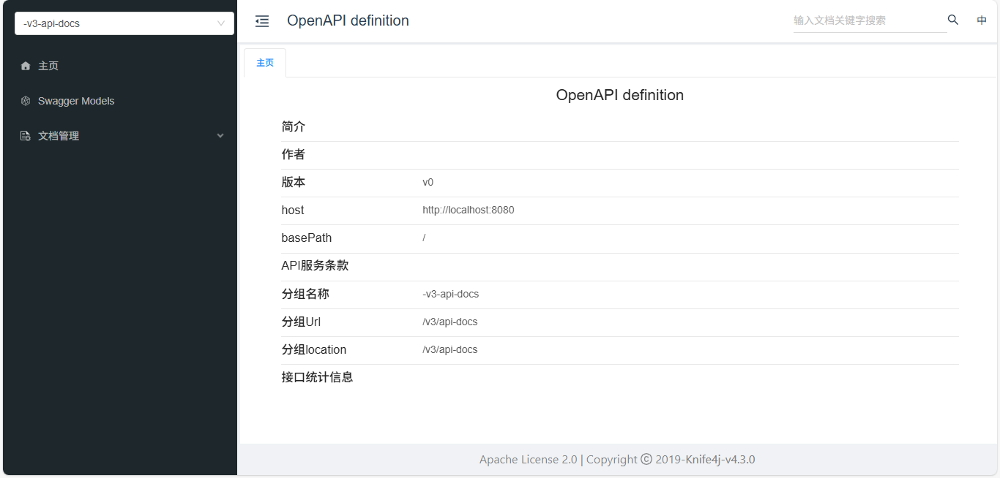

### 3、接入大模型

- **参考文档： Get Started**https://docs.langchain4j.dev/get-started


#### 3.1、LangChain4j 库结构

LangChain4j 具有模块化设计，包括：

1. langchain4j-core 模块，它定义了核心抽象概念（如聊天语言模型和嵌入存储）及其 API。
2. 主 langchain4j 模块，包含有用的工具，如文档加载器、聊天记忆实现，以及诸如人工智能服务等高层功能。
3. 大量的 langchain4j-{集成} 模块，每个模块都将各种大语言模型提供商和嵌入存储集成到 LangChain4j 中。你可以独立使用 langchain4j-{集成} 模块。如需更多功能，只需导入主 langchain4j 依赖项即可。


#### 3.2、添加LangChain4j相关依赖

```xml
<properties>
    <langchain4j.version>1.0.0-beta3</langchain4j.version>
</properties>

<dependencies>
    <!-- 基于open-ai的langchain4j接口：ChatGPT、deepseek都是open-ai标准下的大模型 -->
    <dependency>
        <groupId>dev.langchain4j</groupId>
        <artifactId>langchain4j-open-ai</artifactId>
    </dependency>
</dependencies>

<dependencyManagement>
    <dependencies>
        <!--引入langchain4j依赖管理清单-->
        <dependency>
            <groupId>dev.langchain4j</groupId>
            <artifactId>langchain4j-bom</artifactId>
            <version>${langchain4j.version}</version>
            <type>pom</type>
            <scope>import</scope>
        </dependency>
    </dependencies>
</dependencyManagement>
```

#### 3.3、创建测试用例

接入任何一个大模型都需要先去申请apiKey。

如果你暂时没有密钥，也可以使用LangChain4j 提供的演示密钥，这个密钥是免费的，有使用配额限制，且仅限于 gpt-4o-mini 模型。

```java
package com.atguigu.java.ai.langchain4j;

import dev.langchain4j.model.openai.OpenAiChatModel;
import org.junit.jupiter.api.Test;
import org.springframework.boot.test.context.SpringBootTest;

@SpringBootTest
public class LLMTest {

    /**
     * gpt-4o-mini语言模型接入测试
     */
    @Test
    public void testGPTDemo() {
        //初始化模型
        OpenAiChatModel model = OpenAiChatModel.builder()
                //LangChain4j提供的代理服务器，该代理服务器会将演示密钥替换成真实密钥， 再将请求转发给OpenAI API
                //.baseUrl("http://langchain4j.dev/demo/openai/v1") //设置模型api地址（如果apiKey="demo"，则可省略baseUrl的配置）
                .apiKey("demo") //设置模型apiKey
                .modelName("gpt-4o-mini") //设置模型名称
                .build();

        //向模型提问
        String answer = model.chat("你好");
        //输出结果
        System.out.println(answer);
    }
}
```

### 4、SpringBoot整合

**参考文档：**https://docs.langchain4j.dev/tutorials/spring-boot-integration

#### 4.1、替换依赖

将 `langchain4j-open-ai` 替换成 `langchain4j-open-ai-spring-boot-starter`

```xml
<dependency>
    <groupId>dev.langchain4j</groupId>
    <artifactId>langchain4j-open-ai-spring-boot-starter</artifactId>
</dependency>
```

#### 4.2、配置模型参数

```properties
#langchain4j测试模型
langchain4j.open-ai.chat-model.api-key=demo
langchain4j.open-ai.chat-model.model-name=gpt-4o

#请求和响应日志
langchain4j.open-ai.chat-model.log-requests=true
langchain4j.open-ai.chat-model.log-responses=true
#启用日志debug级别
logging.level.root=debug
```

#### 4.3、创建测试用例

```java
/**
 * 整合SpringBoot
 */
@Autowired
private OpenAiChatModel openAiChatModel;

@Test
public void testSpringBoot() {
    //向模型提问
    String answer = openAiChatModel.chat("你好");
    //输出结果
    System.out.println(answer);
}
```


## 二、接入其他大模型

### 1、都有哪些大模型

- **大语言模型排行榜：**https://superclueai.com/

SuperCLUE 是由国内 CLUE 学术社区于 2023 年 5 月推出的中文通用大模型综合性评测基准。

- **评测目的**：全面评估中文大模型在语义理解、逻辑推理、代码生成等 10 项基础能力，以及涵盖数学、物理、社科等 50 多学科的专业能力，旨在回答在通用大模型发展背景下，中文大模型的效果情况，包括不同任务效果、与国际代表性模型的差距、与人类的效果对比等问题。
- **特色优势**：针对中文特性任务，如成语、诗歌、字形等设立专项评测，使评测更符合中文语言特点。通过 3700 多道客观题和匿名对战机制，动态追踪国内外主流模型，如 GPT-4、文心一言、通义千问等的表现差异，保证评测的客观性和时效性。

- **行业影响**：作为中文领域权威测评社区，其评测结果被学界和产业界广泛引用，例如商汤 “日日新 5.0” 和百度文心大模型均通过 SuperCLUE 验证技术突破，推动了中文 NLP 技术生态的迭代，为中文大模型的发展和优化提供了重要的参考依据，促进了中文大模型技术的不断进步和应用。


- **LangChain4j支持接入的大模型**：https://docs.langchain4j.dev/integrations/language-models/


### 2、接入DeepSeek

#### 1.1、获取开发参数

- **访问官网：**https://www.deepseek.com/  注册账号，获取base_url和api_key，充值

#### 1.2、配置开发参数

为了apikay的安全，建议将其配置在服务器的环境变量中。变量名自定义即可，例如 `DEEP_SEEK_API_KEY`

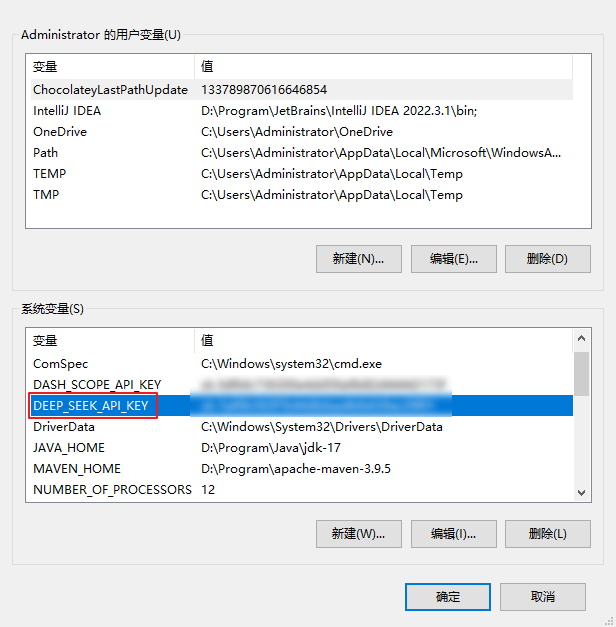

#### 1.3、配置模型参数

**DeepSeek API文档：**https://api-docs.deepseek.com/zh-cn/

在 LangChain4j 中，DeepSeek 和 GPT 一样也使用了 OpenAI 的接口标准，因此也使用OpenAiChatModel进行接入

```properties
#DeepSeek
langchain4j.open-ai.chat-model.base-url=https://api.deepseek.com
langchain4j.open-ai.chat-model.api-key=${DEEP_SEEK_API_KEY}
#DeepSeek-V3
langchain4j.open-ai.chat-model.model-name=deepseek-chat
#DeepSeek-R1 推理模型
#langchain4j.open-ai.chat-model.model-name=deepseek-reasoner
```

#### 1.4、测试

直接使用前面的测试用例即可


### 3、ollama本地部署

#### 3.1、为什么要本地部署

Ollama 是一个本地部署大模型的工具。使用 Ollama 进行本地部署有以下多方面的原因：

- 数据隐私与安全：对于金融、医疗、法律等涉及大量敏感数据的行业，数据安全至关重要。
- 离线可用性：在网络不稳定或无法联网的环境中，本地部署的 Ollama 模型仍可正常运行。
- 降低成本：云服务通常按使用量收费，长期使用下来费用较高。而 Ollama 本地部署，只需一次性投入硬件成本，对于需要频繁使用大语言模型且对成本敏感的用户或企业来说，能有效节约成本。
- 部署流程简单：只需通过简单的命令 “ollama run < 模型名>”，就可以自动下载并运行所需的模型。
- 灵活扩展与定制：可对模型微调，以适配垂直领域需求。

#### 3.2、在ollama上部署DeepSeek

**官网：**https://ollama.com/ 

（1）下载并安装ollama：`OllamaSetup.exe`

（2）查看模型列表，选择要部署的模型，**模型列表：** https://ollama.com/search

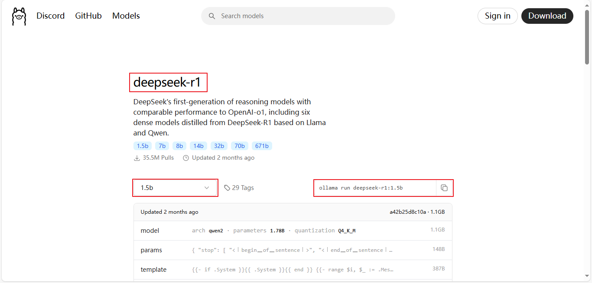

（3）执行命令：`ollama run deepseek-r1:1.5`运行大模型。如果是第一次运行则会先下载大模型

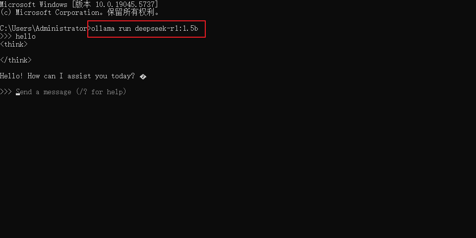

#### 3.3、常用命令

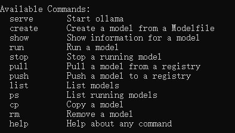

#### 3.4、引入依赖

**参考文档：**https://docs.langchain4j.dev/integrations/language-models/ollama#get-started

```xml
<!-- 接入ollama -->
<dependency>
    <groupId>dev.langchain4j</groupId>
    <artifactId>langchain4j-ollama-spring-boot-starter</artifactId>
</dependency>
```

#### 3.5、配置模型参数

```properties
#ollama
langchain4j.ollama.chat-model.base-url=http://localhost:11434
langchain4j.ollama.chat-model.model-name=deepseek-r1:1.5b
langchain4j.ollama.chat-model.log-requests=true
langchain4j.ollama.chat-model.log-responses=true
```

#### 3.6、创建测试用例

```java
/**
 * ollama接入
 */
@Autowired
private OllamaChatModel ollamaChatModel;
@Test
public void testOllama() {
    //向模型提问
    String answer = ollamaChatModel.chat("你好");
    //输出结果
    System.out.println(answer);
}
```

### 4、接入阿里百炼平台

#### 4.1、什么是阿里百炼

- 阿里云百炼是 2023 年 10 月推出的。它集成了阿里的通义系列大模型和第三方大模型，涵盖文本、图像、音视频等不同模态。

- **功能优势**：集成超百款大模型 API，模型选择丰富；5-10 分钟就能低代码快速构建智能体，应用构建高效；提供全链路模型训练、评估工具及全套应用开发工具，模型服务多元；在线部署可按需扩缩容，新用户有千万 token 免费送，业务落地成本低。


- **支持接入的模型列表：**https://help.aliyun.com/zh/model-studio/models
- **模型广场：**https://bailian.console.aliyun.com/?productCode=p_efm#/model-market


#### 4.2、申请免费体验

（1）点击进入免费体验页面

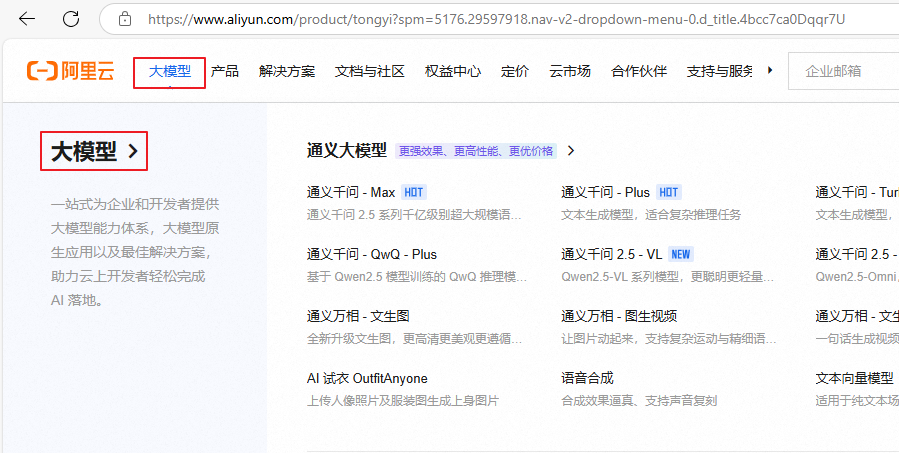

（2）点击免费体验


（3）点击开通服务

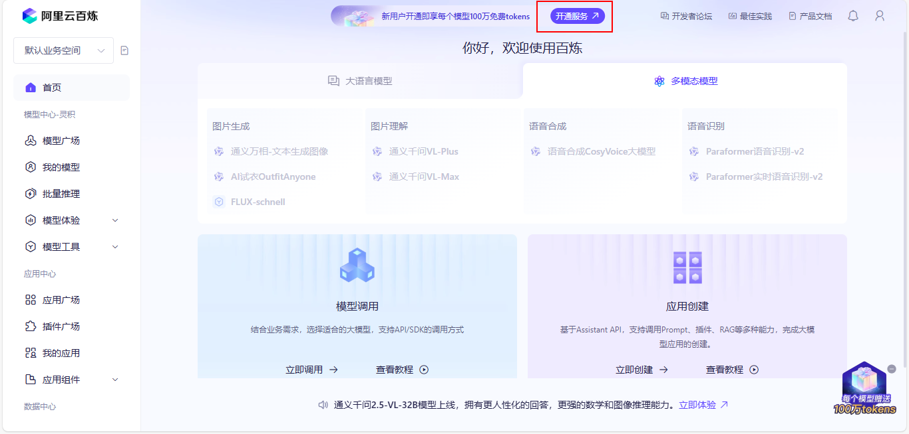

（4）确认开通

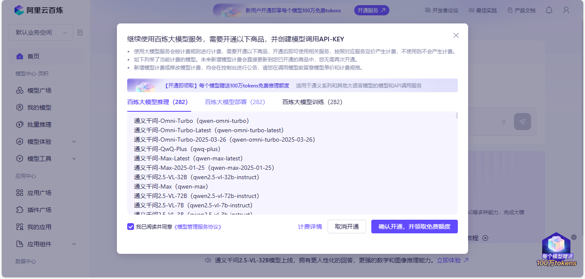


#### 4.3、配置apiKey

**申请apiKey：**https://bailian.console.aliyun.com/?apiKey=1&productCode=p_efm#/api-key

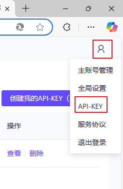

**配置apiKey：**配置在环境变量**DASH_SCOPE_API_KEY**中

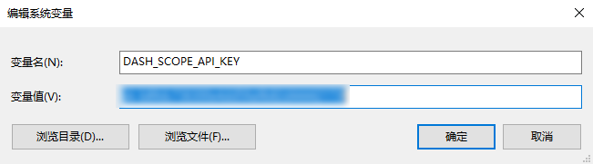

#### 4.4、添加依赖

**LangChain4j参考文档：**https://docs.langchain4j.dev/integrations/language-models/dashscope#plain-java

```xml
<dependencies>
    <!-- 接入阿里云百炼平台 -->
    <dependency>
        <groupId>dev.langchain4j</groupId>
        <artifactId>langchain4j-community-dashscope-spring-boot-starter</artifactId>
    </dependency>
</dependencies>


<dependencyManagement>
  <dependencies>
    <!--引入百炼依赖管理清单-->
    <dependency>
        <groupId>dev.langchain4j</groupId>
        <artifactId>langchain4j-community-bom</artifactId>
        <version>${langchain4j.version}</version>
        <type>pom</type>
        <scope>import</scope>
    </dependency>
 </dependencies>
</dependencyManagement>
```

#### 4.5、配置模型参数

```properties
#阿里百炼平台
langchain4j.community.dashscope.chat-model.api-key=${DASH_SCOPE_API_KEY}
langchain4j.community.dashscope.chat-model.model-name=qwen-max
```

#### 4.6、测试通义千问

```java
/**
 * 通义千问大模型
 */
@Autowired
private QwenChatModel qwenChatModel;
@Test
public void testDashScopeQwen() {
    //向模型提问
    String answer = qwenChatModel.chat("你好");
    //输出结果
    System.out.println(answer);
}
```

#### 4.6、测试通义万象

生成图片测试

```java
@Test
public void testDashScopeWanx(){
    WanxImageModel wanxImageModel = WanxImageModel.builder()
            .modelName("wanx2.1-t2i-plus")
            .apiKey(System.getenv("DASH_SCOPE_API_KEY"))
            .build();
    Response<Image> response = wanxImageModel.generate("奇幻森林精灵：在一片弥漫着轻柔薄雾的古老森林深处，阳光透过茂密枝叶洒下金色光斑。一位身材娇小、长着透明薄翼的精灵少女站在一朵硕大的蘑菇上。她有着海藻般的绿色长发，发间点缀着蓝色的小花，皮肤泛着珍珠般的微光。身上穿着由翠绿树叶和白色藤蔓编织而成的连衣裙，手中捧着一颗散发着柔和光芒的水晶球，周围环绕着五彩斑斓的蝴蝶，脚下是铺满苔藓的地面，蘑菇和蕨类植物丛生，营造出神秘而梦幻的氛围。");
    System.out.println(response.content().url());
}
```

#### 4.7、测试DeepSeek

也可以在阿里百炼上集成第三方大模型，如DeepSeek

将配置参数上的base-url参数指定到百炼平台，使用百炼上的大模型名称和apiKey即可

```properties
#集成百炼-deepseek
langchain4j.open-ai.chat-model.base-url=https://dashscope.aliyuncs.com/compatible-mode/v1
langchain4j.open-ai.chat-model.api-key=${DASH_SCOPE_API_KEY}
langchain4j.open-ai.chat-model.model-name=deepseek-v3
#温度系数：取值范围通常在 0 到 1 之间。值越高，模型的输出越随机、富有创造性；
# 值越低，输出越确定、保守。这里设置为 0.9，意味着模型会有一定的随机性，生成的回复可能会比较多样化。
langchain4j.open-ai.chat-model.temperature=0.9
```

使用之前的测试用例`testSpringBoot`测试即可


## 三、人工智能服务 AIService

### 1、什么是AIService

AIService使用面向接口和动态代理的方式完成程序的编写，更灵活的实现高级功能。

#### 1.1、链 Chain（旧版）

链的概念源自 Python 中的 LangChain。其理念是针对每个常见的用例都设置一条链，比如聊天机器人、检索增强生成（RAG）等。链将多个底层组件组合起来，并协调它们之间的交互。链存在的主要问题是不灵活，我们不进行深入的研究。

#### 1.2、人工智能服务 AIService

在LangChain4j中我们使用AIService完成复杂操作。底层组件将由AIService进行组装。

**AIService可处理最常见的操作：**

- 为大语言模型格式化输入内容
- 解析大语言模型的输出结果

**它们还支持更高级的功能：**

- 聊天记忆 Chat memory
- 工具 Tools
- 检索增强生成 RAG


### 2、创建AIService

#### 2.1、引入依赖

```xml
<!--langchain4j高级功能-->
<dependency>
    <groupId>dev.langchain4j</groupId>
    <artifactId>langchain4j-spring-boot-starter</artifactId>
</dependency>
```

#### 2.2、创建接口

```java
package com.atguigu.java.ai.langchain4j.assistant;

public interface Assistant {
    String chat(String userMessage);
}
```

#### 2.3、测试用例

```java
@SpringBootTest
public class AIServiceTest {

    @Autowired
    private QwenChatModel qwenChatModel;
    
    @Test
    public void testChat() {
        //创建AIService
        Assistant assistant = AiServices.create(Assistant.class, qwenChatModel);
        //调用service的接口
        String answer = assistant.chat("Hello");
        System.out.println(answer);
    }
}
```


#### 2.4、@AiService

也可以在`Assistant`接口上添加`@AiService`注解

```java
package com.atguigu.java.ai.langchain4j.assistant;

//因为我们在配置文件中同时配置了多个大语言模型，所以需要在这里明确指定（EXPLICIT）模型的beanName（qwenChatModel）
@AiService(wiringMode = EXPLICIT, chatModel = "qwenChatModel")
public interface Assistant {
    String chat(String userMessage);
}
```

测试用例中，我们可以直接注入Assistant对象

```java
@Autowired
private Assistant assistant;

@Test
public void testAssistant() {

    String answer = assistant.chat("Hello");
    System.out.println(answer);
}
```


#### 2.5、工作原理

AiServices会**组装Assistant接口以及其他组件**，并使用反射机制创建一个实现Assistant接口的**代理对象**。这个代理对象会处理输入和输出的所有转换工作。在这个例子中，chat方法的输入是一个字符串，但是大模型需要一个`UserMessage`对象。所以，代理对象将这个字符串转换为`UserMessage`，并调用聊天语言模型。chat方法的输出类型也是字符串，但是大模型返回的是 `AiMessage` 对象，代理对象会将其转换为字符串。

**简单理解就是：代理对象的作用是输入转换和输出转换**


## 四、聊天记忆 Chat memory

### 1、测试对话是否有记忆

```java
package com.atguigu.java.ai.langchain4j;

@SpringBootTest
public class ChatMemoryTest {

    @Autowired
    private Assistant assistant;

    @Test
    public void testChatMemory() {

        String answer1 = assistant.chat("我是环环");
        System.out.println(answer1);

        String answer2 = assistant.chat("我是谁");
        System.out.println(answer2);
    }
}
```

很显然，目前的接入方式，大模型是没有记忆的。


### 2、聊天记忆的简单实现

可以使用下面的方式实现对话记忆。

```java
@Autowired
private QwenChatModel qwenChatModel;
@Test
public void testChatMemory2() {

    //第一轮对话
    UserMessage userMessage1 = UserMessage.userMessage("我是环环");
    ChatResponse chatResponse1 = qwenChatModel.chat(userMessage1);
    AiMessage aiMessage1 = chatResponse1.aiMessage();
    //输出大语言模型的回复
    System.out.println(aiMessage1.text());

    //第二轮对话
    UserMessage userMessage2 = UserMessage.userMessage("你知道我是谁吗");
    ChatResponse chatResponse2 = qwenChatModel.chat(Arrays.asList(userMessage1, aiMessage1, userMessage2));
    AiMessage aiMessage2 = chatResponse2.aiMessage();
    //输出大语言模型的回复
    System.out.println(aiMessage2.text());
}
```

### 3、使用ChatMemory实现聊天记忆

使用AIService可以封装多轮对话的复杂性，使聊天记忆功能的实现变得简单

```java
@Test
public void testChatMemory3() {

    //创建chatMemory
    MessageWindowChatMemory chatMemory = MessageWindowChatMemory.withMaxMessages(10);

    //创建AIService
    Assistant assistant = AiServices
            .builder(Assistant.class)
            .chatLanguageModel(qwenChatModel)
            .chatMemory(chatMemory)
            .build();
    //调用service的接口
    String answer1 = assistant.chat("我是环环");
    System.out.println(answer1);
    String answer2 = assistant.chat("我是谁");
    System.out.println(answer2);
}
```


### 4、使用AIService实现聊天记忆

#### 4.1、创建记忆对话智能体

当AIService由多个组件（大模型，聊天记忆，等）组成的时候，我们就可以称他为`智能体`了

```java
package com.atguigu.java.ai.langchain4j.assistant;

@AiService(
    wiringMode = EXPLICIT,
    chatModel = "qwenChatModel",
    chatMemory = "chatMemory"
)
public interface MemoryChatAssistant {

    String chat(String message);
}
```

#### 4.2、配置ChatMemory

```java
package com.atguigu.java.ai.langchain4j.config;

@Configuration
public class MemoryChatAssistantConfig {

    @Bean
    ChatMemory chatMemory() {
        //设置聊天记忆记录的message数量
        return MessageWindowChatMemory.withMaxMessages(10);
    }
}

```

#### 4.3、测试

```java
@Autowired
private MemoryChatAssistant memoryChatAssistant;

@Test
public void testChatMemory4() {
    String answer1 = memoryChatAssistant.chat("我是环环");
    System.out.println(answer1);
    String answer2 = memoryChatAssistant.chat("我是谁");
    System.out.println(answer2);
}
```


### 5、隔离聊天记忆

为每个用户的新聊天或者不同的用户区分聊天记忆

#### 5.1、创建记忆隔离对话智能体

```java
package com.atguigu.java.ai.langchain4j.assistant;

@AiService(
    wiringMode = EXPLICIT, 
    chatMemory = "chatMemory",
    chatMemoryProvider = "chatMemoryProvider"
)
public interface SeparateChatAssistant {

    /**
     * 分离聊天记录
     * @param memoryId 聊天id
     * @param userMessage 用户消息
     * @return
     */
    String chat(@MemoryId int memoryId, @UserMessage String userMessage);
}
```

#### 5.2、配置ChatMemoryProvider

```java
package com.atguigu.java.ai.langchain4j.config;

@Configuration
public class SeparateChatAssistantConfig {

    @Bean
    ChatMemoryProvider chatMemoryProvider() {
        return memoryId -> MessageWindowChatMemory.builder()
                .id(memoryId)
            	.maxMessages(10)
                .build();
    }
}

```

#### 5.3、测试对话助手

用两个不同的memoryId测试聊天记忆的隔离效果

```java
@Autowired
private SeparateChatAssistant separateChatAssistant;

@Test
public void testChatMemory5() {
    String answer1 = separateChatAssistant.chat(1,"我是环环");
    System.out.println(answer1);
    String answer2 = separateChatAssistant.chat(1,"我是谁");
    System.out.println(answer2);
    String answer3 = separateChatAssistant.chat(2,"我是谁");
    System.out.println(answer3);
}
```


## 五、持久化聊天记忆 Persistence

默认情况下，聊天记忆存储在内存中。如果需要持久化存储，可以实现一个自定义的聊天记忆存储类，以便将聊天消息存储在你选择的任何持久化存储介质中。

### 1、存储介质的选择

大模型中聊天记忆的存储选择哪种数据库，需要综合考虑数据特点、应用场景和性能要求等因素，以下是一些常见的选择及其特点：

- MySQL

  - **特点**：关系型数据库。支持事务处理，确保数据的一致性和完整性，适用于结构化数据的存储和查询。

  - **适用场景**：如果聊天记忆数据结构较为规整，例如包含固定的字段如对话 ID、用户 ID、时间戳、消息内容等，且需要进行复杂的查询和统计分析，如按用户统计对话次数、按时间范围查询特定对话等，MySQL 是不错的选择。


- Redis

  - **特点**：内存数据库，读写速度极高。它适用于存储热点数据，并且支持多种数据结构，如字符串、哈希表、列表等，方便对不同类型的聊天记忆数据进行处理。

  - **适用场景**：对于实时性要求极高的聊天应用，如在线客服系统或即时通讯工具，Redis 可以快速存储和获取最新的聊天记录，以提供流畅的聊天体验。


- MongoDB

  - **特点**：文档型数据库，数据以 JSON - like 的文档形式存储，具有高度的灵活性和可扩展性。它不需要预先定义严格的表结构，适合存储半结构化或非结构化的数据。

  - **适用场景**：当聊天记忆中包含多样化的信息，如文本消息、图片、语音等多媒体数据，或者消息格式可能会频繁变化时，MongoDB 能很好地适应这种灵活性。例如，一些社交应用中用户可能会发送各种格式的消息，使用 MongoDB 可以方便地存储和管理这些不同类型的数据。


- Cassandra

  - **特点**：是一种分布式的 NoSQL 数据库，具有高可扩展性和高可用性，能够处理大规模的分布式数据存储和读写请求。适合存储海量的、时间序列相关的数据。

  - **适用场景**：对于大型的聊天应用，尤其是用户量众多、聊天数据量巨大且需要分布式存储和处理的场景，Cassandra 能够有效地应对高并发的读写操作。例如，一些面向全球用户的社交媒体平台，其聊天数据需要在多个节点上进行分布式存储和管理，Cassandra 可以提供强大的支持。


### 2、MongoDB

#### 2.1、简介

MongoDB 是一个基于文档的 NoSQL 数据库，由 MongoDB Inc. 开发。

NoSQL，指的是非关系型的数据库。NoSQL有时也称作Not Only SQL的缩写，是对不同于传统的关系型数据库的数据库管理系统的统称。

MongoDB 的设计理念是为了应对大数据量、高性能和灵活性需求。

MongoDB使用集合（Collections）来组织文档（Documents），每个文档都是由键值对组成的。

- **数据库（Database）**：存储数据的容器，类似于关系型数据库中的数据库。
- **集合（Collection）**：数据库中的一个集合，类似于关系型数据库中的表。
- **文档（Document）**：集合中的一个数据记录，类似于关系型数据库中的行（row），以 BSON 格式存储。

MongoDB 将数据存储为一个文档，数据结构由键值(key=>value)对组成，文档类似于 JSON 对象，字段值可以包含其他文档，数组及文档数组：


#### 2.2、安装MongoDB

服务器：`mongodb-windows-x86_64-8.0.6-signed.msi `https://www.mongodb.com/try/download/community

命令行客户端 ：`mongosh-2.5.0-win32-x64.zip` https://www.mongodb.com/try/download/shell

图形客户端：`mongodb-compass-1.39.3-win32-x64.exe` https://www.mongodb.com/try/download/compass


#### 2.3、使用mongosh

**启动 MongoDB Shell：**

在命令行中输入 mongosh 命令，启动 MongoDB Shell，如果 MongoDB 服务器运行在本地默认端口（27017），则可以直接连接。

```
mongosh
```

**连接到 MongoDB 服务器：**

如果 MongoDB 服务器运行在非默认端口或者远程服务器上，可以使用以下命令连接：

```
mongosh --host <hostname>:<port>
```

其中 `<hostname>` 是 MongoDB 服务器的主机名或 IP 地址，`<port>` 是 MongoDB 服务器的端口号。

**执行基本操作：**

连接成功后，可以执行各种 MongoDB 数据库操作。例如：

- 查看当前数据库：`db`
- 显示数据库列表：`show dbs`
- 切换到指定数据库：`use <database_name>`
- 执行查询操作：`db.<collection_name>.find()`
- 插入文档：`db.<collection_name>.insertOne({ ... })`
- 更新文档：`db.<collection_name>.updateOne({ ... })`
- 删除文档：`db.<collection_name>.deleteOne({ ... })`
- 退出 MongoDB Shell：`quit()` 或者 `exit`

**CRUD**

```shell
# 插入文档
test> db.mycollection.insertOne({ name: "Alice", age: 30 })
# 查询文档
test> db.mycollection.find()
# 更新文档
test> db.mycollection.updateOne({ name: "Alice" }, { $set: { age: 31 } })
# 删除文档
test> db.mycollection.deleteOne({ name: "Alice" })
# 退出 MongoDB Shell
test> quit()
```


#### 2.4、使用mongodb-compass

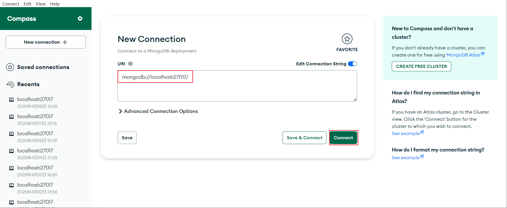


#### 2.5、整合SpringBoot

引入MongoDB依赖：

```xml
<!-- Spring Boot Starter Data MongoDB -->
<dependency>
    <groupId>org.springframework.boot</groupId>
    <artifactId>spring-boot-starter-data-mongodb</artifactId>
</dependency>
```

添加远程连接配置：

```properties
#MongoDB连接配置
spring.data.mongodb.uri=mongodb://localhost:27017/chat_memory_db
```


#### 2.6、CRUD测试

创建实体类：映射MongoDB中的文档（相当与MySQL的表）

```java
package com.atguigu.java.ai.langchain4j.bean;

@Data
@AllArgsConstructor
@NoArgsConstructor
@Document("chat_messages")
public class ChatMessages {

    //唯一标识，映射到 MongoDB 文档的 _id 字段
    @Id
    private ObjectId messageId;
    //private Long messageId;
    
    private String content; //存储当前聊天记录列表的json字符串
}
```

创建测试类：

```java
package com.atguigu.java.ai.langchain4j;

@SpringBootTest
public class MongoCrudTest {

    @Autowired
    private MongoTemplate mongoTemplate;

    /**
     * 插入文档
     */
   /* @Test
    public void testInsert() {
        mongoTemplate.insert(new ChatMessages(1L, "聊天记录"));
    }*/

    /**
     * 插入文档
     */
    @Test
    public void testInsert2() {
        ChatMessages chatMessages = new ChatMessages();
        chatMessages.setContent("聊天记录列表");
        mongoTemplate.insert(chatMessages);
    }

    /**
     * 根据id查询文档
     */
    @Test
    public void testFindById() {
        ChatMessages chatMessages = mongoTemplate.findById("6801ead733ba9c4a0d9b6c7b", ChatMessages.class);
        System.out.println(chatMessages);
    }

    /**
     * 修改文档
     */
    @Test
    public void testUpdate() {

        Criteria criteria = Criteria.where("_id").is("6801ead733ba9c4a0d9b6c7b");
        Query query = new Query(criteria);
        Update update = new Update();
        update.set("content", "新的聊天记录列表");

        //修改或新增
        mongoTemplate.upsert(query, update, ChatMessages.class);
    }

    /**
     * 新增或修改文档
     */
    @Test
    public void testUpdate2() {

        Criteria criteria = Criteria.where("_id").is("100");
        Query query = new Query(criteria);
        Update update = new Update();
        update.set("content", "新的聊天记录列表");

        //修改或新增
        mongoTemplate.upsert(query, update, ChatMessages.class);
    }

    /**
     * 删除文档
     */
    @Test
    public void testDelete() {
        Criteria criteria = Criteria.where("_id").is("100");
        Query query = new Query(criteria);
        mongoTemplate.remove(query, ChatMessages.class);
    }
}
```

### 3、持久化聊天

#### 3.1、优化实体类

```java
package com.atguigu.java.ai.langchain4j.bean;

@Data
@AllArgsConstructor
@NoArgsConstructor
@Document("chat_messages")
public class ChatMessages {

    //唯一标识，映射到 MongoDB 文档的 _id 字段
    @Id
    private ObjectId id;

    private int messageId;

    private String content; //存储当前聊天记录列表的json字符串
}
```

#### 3.2、创建持久化类

创建一个类实现ChatMemoryStore接口

```java
package com.atguigu.java.ai.langchain4j.store;

@Component
public class MongoChatMemoryStore implements ChatMemoryStore {

    @Autowired
    private MongoTemplate mongoTemplate;

    @Override
    public List<ChatMessage> getMessages(Object memoryId) {
        Criteria criteria = Criteria.where("memoryId").is(memoryId);
        Query query = new Query(criteria);
        ChatMessages chatMessages = mongoTemplate.findOne(query, ChatMessages.class);
        if(chatMessages == null) return new LinkedList<>();
        return ChatMessageDeserializer.messagesFromJson(chatMessages.getContent());
    }

    @Override
    public void updateMessages(Object memoryId, List<ChatMessage> messages) {

        Criteria criteria = Criteria.where("memoryId").is(memoryId);
        Query query = new Query(criteria);

        Update update = new Update();
        update.set("content", ChatMessageSerializer.messagesToJson(messages));

        //根据query条件能查询出文档，则修改文档；否则新增文档
        mongoTemplate.upsert(query, update, ChatMessages.class);
    }

    @Override
    public void deleteMessages(Object memoryId) {
        Criteria criteria = Criteria.where("memoryId").is(memoryId);
        Query query = new Query(criteria);
        mongoTemplate.remove(query, ChatMessages.class);
    }
}
```

在SeparateChatAssistantConfig中，添加MongoChatMemoryStore对象的配置

```java
package com.atguigu.java.ai.langchain4j.config;

@Configuration
public class SeparateChatAssistantConfig {

    //注入持久化对象
    @Autowired
    private MongoChatMemoryStore mongoChatMemoryStore;

    @Bean
    ChatMemoryProvider chatMemoryProvider() {
        return memoryId -> MessageWindowChatMemory.builder()
                .id(memoryId)
                .maxMessages(10)
                .chatMemoryStore(mongoChatMemoryStore)//配置持久化对象
                .build();
    }
}
```

### 4、测试

发现MongoDB中已经存储了会话记录

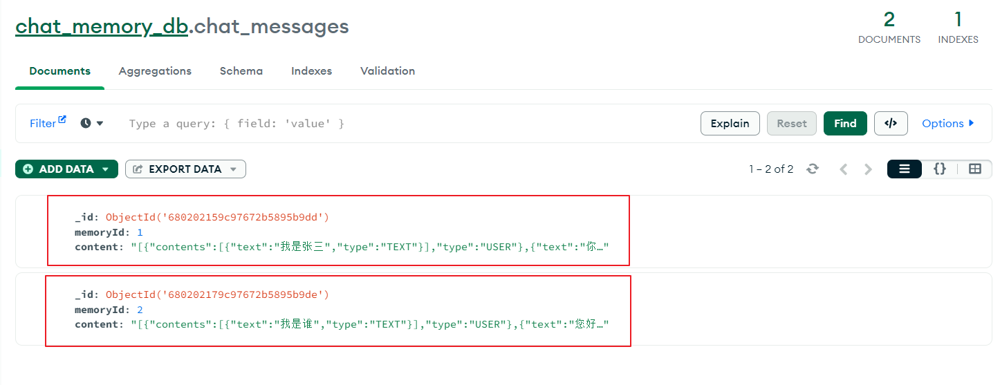


## 六、提示词 Prompt

### 1、系统提示词

**@SystemMessage** 设定角色，塑造AI助手的专业身份，明确助手的能力范围

#### 1.1、配置@SystemMessage

在SeparateChatAssistant类的chat方法上添加@SystemMessage注解

```java
@SystemMessage("你是我的好朋友，请用东北话回答问题。")//系统消息提示词
String chat(@MemoryId int memoryId, @UserMessage String userMessage);
```

`@SystemMessage`的内容将在后台转换为 `SystemMessage`对象，并与 `UserMessage` 一起发送给大语言模型（LLM）。

SystemMessaged的内容只会发送给大模型一次。

如果你修改了SystemMessage的内容，新的SystemMessage会被发送给大模型，之前的聊天记忆会失效。


#### 1.2、测试

```java
package com.atguigu.java.ai.langchain4j;

@SpringBootTest
public class PromptTest {

    @Autowired
    private SeparateChatAssistant separateChatAssistant;

    @Test
    public void testSystemMessage() {
        String answer = separateChatAssistant.chat(3,"今天几号");
        System.out.println(answer);
    }
}
```

如果要显示今天的日期，我们需要在提示词中添加当前日期的占位符{{current_date}}

```java
@SystemMessage("你是我的好朋友，请用东北话回答问题。今天是{{current_date}}")//系统消息提示词
String chat(@MemoryId int memoryId, @UserMessage String userMessage);
```


#### 1.3、从资源中加载提示模板

`@SystemMessage` 注解还可以从资源中加载提示模板：

```java
@SystemMessage(fromResource = "my-prompt-template.txt")
String chat(@MemoryId int memoryId, @UserMessage String userMessage);
```

my-prompt-template.txt

```txt
你是我的好朋友，请用东北话回答问题，回答问题的时候适当添加表情符号。
```

{{current_date}}表示当前日期

```text
你是我的好朋友，请用东北话回答问题，回答问题的时候适当添加表情符号。
今天是 {{current_date}}。
```


### 2、用户提示词模板

**@UserMessage：**获取用户输入

#### 2.1、配置@UserMessage

在`MemoryChatAssistant`的`chat`方法中添加注解

```java
@UserMessage("你是我的好朋友，请用上海话回答问题，并且添加一些表情符号。 {{it}}") //{{it}}表示这里唯一的参数的占位符
String chat(String message);
```


#### 2.2、测试

```java
@Autowired
private MemoryChatAssistant memoryChatAssistant;

@Test
public void testUserMessage() {
    String answer = memoryChatAssistant.chat("我是环环");
    System.out.println(answer);
}
```


### 3、指定参数名称

#### 3.1、配置@V

**@V** 明确指定传递的参数名称

```java
@UserMessage("你是我的好朋友，请用上海话回答问题，并且添加一些表情符号。{{message}}")
String chat(@V("message") String userMessage);
```


#### 3.2、多个参数的情况

如果有两个或两个以上的参数，我们必须要用`@V`，在`SeparateChatAssistant`中定义方法`chat2`

```java
@UserMessage("你是我的好朋友，请用粤语回答问题。{{message}}")
String chat2(@MemoryId int memoryId, @V("message") String userMessage);
```

测试：`@UserMessage`中的内容每次都会被和用户问题组织在一起发送给大模型

```java
@Test
public void testV() {
    String answer1 = separateChatAssistant.chat2(1, "我是环环");
    System.out.println(answer1);
    String answer2 = separateChatAssistant.chat2(1, "我是谁");
    System.out.println(answer2);
}
```


#### 3.3、@SystemMessage和@V

也可以将`@SystemMessage`和`@V`结合使用

在`SeparateChatAssistant`中添加方法chat3

```java
@SystemMessage(fromResource = "my-prompt-template3.txt")
String chat3(
    @MemoryId int memoryId, 
    @UserMessage String userMessage, 
    @V("username") String username, 
    @V("age") int age
);
```

创建提示词模板my-prompt-template3.txt，添加占位符

```txt
你是我的好朋友，我是{{username}}，我的年龄是{{age}}，请用东北话回答问题，回答问题的时候适当添加表情符号。
今天是 {{current_date}}。
```

测试：

```java
@Test
public void testUserInfo() {
    String answer = separateChatAssistant.chat3(1, "我是谁，我多大了", "翠花", 18);
    System.out.println(answer);
}
```


## 七、项目实战-创建硅谷小智

这部分我们实现硅谷小智的基本聊天功能，包含聊天记忆、聊天记忆持久化、提示词

### 1、创建硅谷小智

创建XiaozhiAgent

```java
package com.atguigu.java.ai.langchain4j.assistant;

import dev.langchain4j.service.*;
import dev.langchain4j.service.spring.AiService;

import static dev.langchain4j.service.spring.AiServiceWiringMode.EXPLICIT;

@AiService(
        wiringMode = EXPLICIT,
        chatModel = "qwenChatModel",
        chatMemoryProvider = "chatMemoryProviderXiaozhi")
public interface XiaozhiAgent {
	
	@SystemMessage(fromResource = "zhaozhi-prompt-template.txt")
    String chat(@MemoryId Long memoryId, @UserMessage String userMessage);
}
```

### 2、提示词模板

zhaozhi-prompt-template.txt

```txt
你的名字是“硅谷小智”，你是一家名为“北京协和医院”的智能客服。
你是一个训练有素的医疗顾问和医疗伴诊助手。
你态度友好、礼貌且言辞简洁。

1、请仅在用户发起第一次会话时，和用户打个招呼，并介绍你是谁。

2、作为一个训练有素的医疗顾问：
请基于当前临床实践和研究，针对患者提出的特定健康问题，提供详细、准确且实用的医疗建议。请同时考虑可能的病因、诊断流程、治疗方案以及预防措施，并给出在不同情境下的应对策略。对于药物治疗，请特别指明适用的药品名称、剂量和疗程。如果需要进一步的检查或就医，也请明确指示。

3、作为医疗伴诊助手，你可以回答用户就医流程中的相关问题，主要包含以下功能：
AI分导诊：根据患者的病情和就医需求，智能推荐最合适的科室。
AI挂号助手：实现智能查询是否有挂号号源服务；实现智能预约挂号服务；实现智能取消挂号服务。

4、你必须遵守的规则如下：
在获取挂号预约详情或取消挂号预约之前，你必须确保自己知晓用户的姓名（必选）、身份证号（必选）、预约科室（必选）、预约日期（必选，格式举例：2025-04-14）、预约时间（必选，格式：上午 或 下午）、预约医生（可选）。
当被问到其他领域的咨询时，要表示歉意并说明你无法在这方面提供帮助。

5、请在回答的结果中适当包含一些轻松可爱的图标和表情。

6、今天是 {{current_date}}。
```


### 3、配置小智助手

配置持久化和记忆隔离

```java
package com.atguigu.java.ai.langchain4j.config;

@Configuration
public class XiaozhiAgentConfig {

    @Autowired
    private MongoChatMemoryStore mongoChatMemoryStore;

    @Bean
    ChatMemoryProvider chatMemoryProviderXiaozhi() {
        return memoryId -> MessageWindowChatMemory.builder()
                .id(memoryId)
                .maxMessages(20)
                .chatMemoryStore(mongoChatMemoryStore)
                .build();
    }
}

```


### 4、封装对话对象

```java
package com.atguigu.java.ai.langchain4j.bean;

@Data
public class ChatForm {
    private Long memoryId;//对话id
    private String message;//用户问题
}
```


### 5、添加Controller方法

```java
package com.atguigu.java.ai.langchain4j.controller;

@Tag(name = "硅谷小智")
@RestController
@RequestMapping("/xiaozhi")
public class XiaozhiController {

    @Autowired
    private XiaozhiAgent xiaozhiAgent;
    @Operation(summary = "对话")
    @PostMapping("/chat")
    public String chat(@RequestBody ChatForm chatForm)  {
        return xiaozhiAgent.chat(chatForm.getMemoryId(), chatForm.getMessage());
    }
}
```


### 6、待优化

信息查询：提示词中还应该提供医院信息（如位置信息，营业时间等）、科室信息（都有哪些科室）、医生信息（都有哪些医生）

业务实现：预约、取消预约、查询是否预约等


信息查询可以使用RAG检索增强生成

业务实现需要通过Function Calling函数调用


## 八、 Function Calling 函数调用 

`Function Calling 函数调用` 也叫  `Tools 工具`

### 1、入门案例

例如，大语言模型本身并不擅长数学运算。如果应用场景中偶尔会涉及到数学计算，我们可以为他提供一个 “数学工具”。当我们提出问题时，大语言模型会判断是否使用某个工具。

#### 1.1、创建工具类

用 `@Tool` 注解的方法：

- 既可以是静态的，也可以是非静态的；
- 可以具有任何可见性（公有、私有等）。

```java
package com.atguigu.java.ai.langchain4j.tools;

@Component
public class CalculatorTools {
    
    @Tool
    double sum(double a, double b) {
        System.out.println("调用加法运算");
        return a + b;
    }

    @Tool
    double squareRoot(double x) {
         System.out.println("调用平方根运算");
        return Math.sqrt(x);
    }
}
```

#### 1.2、配值工具类

在SeparateChatAssistant中添加tools属性配置

```java
@AiService(
        wiringMode = EXPLICIT,
        chatModel = "qwenChatModel",
        chatMemoryProvider = "chatMemoryProvider",
        tools = "calculatorTools" //配置tools
)
```

#### 1.3、测试工具类

```java
package com.atguigu.java.ai.langchain4j;

@SpringBootTest
public class ToolsTest {

    @Autowired
    private SeparateChatAssistant separateChatAssistant;

    @Test
    public void testCalculatorTools() {

        String answer = separateChatAssistant.chat(1, "1+2等于几，475695037565的平方根是多少？");
        //答案：3，689706.4865
        System.out.println(answer);
    }
}
```

测试后可以查看持久化存储中SYSTEM、USER、AI以及Tools的消息，分析tools的调用流程：

```
Request:
\- messages:
	\- SystemMessage:
		\- text: 系统定义AI的角色
    \- UserMessage:
        \- text: 用户提问
    \- AiMessage:
        \- toolExecutionRequests:
            \- ai获取提问信息组织参数调用工具方法
    \- ToolExecutionResultMessage:
        \- text: 工具方法执行

Response :
\- AiMessage:
    \- text: 根据工具方法的执行ai再次组织结果返回
```


### 2、@Tool 注解的可选字段

`@Tool` 注解有两个可选字段：

- **name（工具名称）**：工具的名称。如果未提供该字段，方法名会作为工具的名称。
- **value（工具描述）**：工具的描述信息。

根据工具的不同，即使没有任何描述，大语言模型可能也能很好地理解它（例如，`add(a, b)` 就很直观），但通常最好提供清晰且有意义的名称和描述。这样，大语言模型就能获得更多信息，以决定是否调用给定的工具以及如何调用。

### 3、@P 注解

方法参数可以选择使用 `@P` 注解进行标注。

`@P` 注解有两个字段：

- **value**：参数的描述信息，这是必填字段。
- **required**：表示该参数是否为必需项，默认值为 `true`，此为可选字段。

### 4、@ToolMemoryId

如果你的AIService方法中有一个参数使用 `@MemoryId` 注解，那么你也可以使用 `@ToolMemoryId` 注解 `@Tool` 方法中的一个参数。提供给AIService方法的值将自动传递给 `@Tool` 方法。如果你有多个用户，或每个用户有多个聊天记忆，并且希望在 `@Tool` 方法中对它们进行区分，那么这个功能会很有用。

```java
package com.atguigu.java.ai.langchain4j.tools;

public class CalculatorTools {

    @Tool(name = "加法", value = "返回两个参数相加之和")
    double sum(
            @ToolMemoryId int memoryId,
            @P(value="加数1", required = true) double a,
            @P(value="加数2", required = true) double b) {
        System.out.println("调用加法运算 " + memoryId);
        return a + b;
    }

    @Tool(name = "平方根", value = "返回给定参数的平方根")
    double squareRoot(
            @ToolMemoryId int memoryId, double x) {

        System.out.println("调用平方根运算 " + memoryId);
        return Math.sqrt(x);
    }
}
```


## 九、项目实战-优化硅谷小智

### 1、预约业务的实现

这部分我们实现硅谷小智的查询订单、预约订单、取消订单的功能

#### 1.1、创建MySQL数据库表

```sql
CREATE DATABASE `guiguxiaozhi`;
USE `guiguxiaozhi`;
CREATE TABLE `appointment` (
  `id` BIGINT NOT NULL AUTO_INCREMENT,
  `username` VARCHAR(50) NOT NULL,
  `id_card` VARCHAR(18) NOT NULL,
  `department` VARCHAR(50) NOT NULL,
  `date` VARCHAR(10) NOT NULL,
  `time` VARCHAR(10) NOT NULL,
  `doctor_name` VARCHAR(50) DEFAULT NULL,
   PRIMARY KEY (`id`)
);
```


#### 1.2、引入依赖

```xml
<!-- Mysql Connector -->
<dependency>
    <groupId>com.mysql</groupId>
    <artifactId>mysql-connector-j</artifactId>
</dependency>
<!--mybatis-plus 持久层-->
<dependency>
    <groupId>com.baomidou</groupId>
    <artifactId>mybatis-plus-spring-boot3-starter</artifactId>
    <version>${mybatis-plus.version}</version>
</dependency>
```


#### 1.3、配置数据库连接

application.properties

```properties
# 基本数据源配置
spring.datasource.url=jdbc:mysql://localhost:3306/guiguxiaozhi?useUnicode=true&characterEncoding=UTF-8&serverTimezone=Asia/Shanghai&useSSL=false
spring.datasource.username=root
spring.datasource.password=123456
spring.datasource.driver-class-name=com.mysql.cj.jdbc.Driver
# 开启 SQL 日志打印
mybatis-plus.configuration.log-impl=org.apache.ibatis.logging.stdout.StdOutImpl
```


#### 1.4、创建实体类

```java
package com.atguigu.java.ai.langchain4j.entity;

@Data
@AllArgsConstructor
@NoArgsConstructor
public class Appointment {

    @TableId(type = IdType.AUTO)
    private Long id;
    private String username;
    private String idCard;
    private String department;
    private String date;
    private String time;
    private String doctorName;
}
```


#### 1.5、Mapper

接口

```java
package com.atguigu.java.ai.langchain4j.mapper;

@Mapper
public interface AppointmentMapper extends BaseMapper<Appointment> {
}
```

xml：在resources下创建mapper目录，创建AppointmentMapper.xml

```xml
<?xml version="1.0" encoding="UTF-8"?>
<!DOCTYPE mapper PUBLIC "-//mybatis.org//DTD Mapper 3.0//EN" "http://mybatis.org/dtd/mybatis-3-mapper.dtd">
<mapper namespace="com.atguigu.java.ai.langchain4j.mapper.AppointmentMapper">

</mapper>
```


#### 1.6、Service

接口

```java
package com.atguigu.java.ai.langchain4j.service;

public interface AppointmentService extends IService<Appointment> {
    Appointment getOne(Appointment appointment);
}
```

实现类

```java
package com.atguigu.java.ai.langchain4j.service.impl;

@Service
public class AppointmentServiceImpl extends ServiceImpl<AppointmentMapper, Appointment> implements AppointmentService {

    /**
     * 查询订单是否存在
     * @param appointment
     * @return
     */
    @Override
    public Appointment getOne(Appointment appointment) {
        LambdaQueryWrapper<Appointment> queryWrapper = new LambdaQueryWrapper<>();
        queryWrapper.eq(Appointment::getUsername, appointment.getUsername());
        queryWrapper.eq(Appointment::getIdCard, appointment.getIdCard());
        queryWrapper.eq(Appointment::getDepartment, appointment.getDepartment());
        queryWrapper.eq(Appointment::getDate, appointment.getDate());
        queryWrapper.eq(Appointment::getTime, appointment.getTime());

        Appointment appointmentDB = baseMapper.selectOne(queryWrapper);
        return appointmentDB;
    }
}
```


#### 1.7、创建测试用例

```java
package com.atguigu.java.ai.langchain4j.service;

@SpringBootTest
class AppointmentServiceTest {

    @Autowired
    private AppointmentService appointmentService;

    @Test
    void testGetOne() {
        Appointment appointment = new Appointment();
        appointment.setUsername("张三");
        appointment.setIdCard("123456789012345678");
        appointment.setDepartment("内科");
        appointment.setDate("2025-04-14");
        appointment.setTime("上午");

        Appointment appointmentDB = appointmentService.getOne(appointment);
        System.out.println(appointmentDB);
    }

    @Test
    void testSave() {
        Appointment appointment = new Appointment();
        appointment.setUsername("张三");
        appointment.setIdCard("123456789012345678");
        appointment.setDepartment("内科");
        appointment.setDate("2025-04-14");
        appointment.setTime("上午");
        appointment.setDoctorName("张医生");

        appointmentService.save(appointment);
    }

    @Test
    void testRemoveById() {
        appointmentService.removeById(1L);
    }
}
```


### 2、Tools

#### 2.1、创建Tools

```java
package com.atguigu.java.ai.langchain4j.tools;

import com.atguigu.java.ai.langchain4j.entity.Appointment;
import com.atguigu.java.ai.langchain4j.service.AppointmentService;
import dev.langchain4j.agent.tool.P;
import dev.langchain4j.agent.tool.Tool;
import org.springframework.beans.factory.annotation.Autowired;
import org.springframework.stereotype.Component;

@Component
public class AppointmentTools {

    @Autowired
    private AppointmentService appointmentService;

    @Tool(name="预约挂号", value = "根据参数，先执行工具方法queryDepartment查询是否可预约，并直接给用户回答是否可预约，并让用户确认所有预约信息，用户确认后再进行预约。")
    public String bookAppointment(Appointment appointment){

        //查找数据库中是否包含对应的预约记录
        Appointment appointmentDB = appointmentService.getOne(appointment);

        if(appointmentDB == null){
            appointment.setId(null);//防止大模型幻觉设置了id
            if(appointmentService.save(appointment)){
                return "预约成功，并返回预约详情";
            }else{
                return "预约失败";
            }
        }

        return "您在相同的科室和时间已有预约";
    }

    @Tool(name="取消预约挂号", value = "根据参数，查询预约是否存在，如果存在则删除预约记录并返回取消预约成功，否则返回取消预约失败")
    public String cancelAppointment(Appointment appointment){

        Appointment appointmentDB = appointmentService.getOne(appointment);
        if(appointmentDB != null){
            //删除预约记录
            if(appointmentService.removeById(appointmentDB.getId())){
                return "取消预约成功";
            }else{
                return "取消预约失败";
            }
        }

        //取消失败
        return "您没有预约记录，请核对预约科室和时间";
    }


    @Tool(name = "查询是否有号源", value="根据科室名称，日期，时间和医生查询是否有号源，并返回给用户")
    public boolean queryDepartment(
            @P(value = "科室名称") String name,
            @P(value = "日期") String date,
            @P(value = "时间，可选值：上午、下午") String time,
            @P(value = "医生名称", required = false) String doctorName
    ) {

        System.out.println("查询是否有号源");
        System.out.println("科室名称：" + name);
        System.out.println("日期：" + date);
        System.out.println("时间：" + time);
        System.out.println("医生名称：" + doctorName);

        //TODO 维护医生的排班信息：
        //如果没有指定医生名字，则根据其他条件查询是否有可以预约的医生（有返回true，否则返回false）；

        //如果指定了医生名字，则判断医生是否有排班（没有排版返回false）
        //如果有排班，则判断医生排班时间段是否已约满（约满返回false，有空闲时间返回true）

        return true;
    }

}
```

#### 2.2、配置Tools

在`XiaozhiAgent`中添加`tools`配置

```java
@AiService(
        wiringMode = EXPLICIT,
        chatModel = "qwenChatModel",
        chatMemoryProvider = "chatMemoryProviderXiaozhi",
        tools = "appointmentTools" //tools配置
)
```

#### 2.3、测试

在Controller中测试


## 十、检索增强生成 RAG

### 1、如何让大模型回答专业领域的知识

LLM 的知识仅限于它所训练的数据。 如果你想让 LLM 了解特定领域的知识或专有数据，你可以：

- `使用 RAG`
- 使用你的数据微调 LLM
- 结合 RAG 和微调


#### 1.1、微调大模型

在现有大模型的基础上，使用小规模的特定任务数据进行再次训练，调整模型参数，让模型更精确地处理特定领域或任务的数据。更新需重新训练，计算资源和时间成本高。

- 优点：一次会话只需一次模型调用，速度快，在特定任务上性能更高，准确性也更高。
- 缺点：知识更新不及时，模型训成本高、训练周期长。
- 应用场景：适合知识库稳定、对生成内容准确性和风格要求高的场景，如对上下文理解和语言生成质量要求高的文学创作、专业文档生成等。


#### 1.2、RAG

**R**etrieval-**A**ugmented **G**eneration 检索增强生成

将原始问题以及提示词信息发送给大语言模型之前，先通过外部知识库检索相关信息，然后将检索结果和原始问题一起发送给大模型，大模型依据外部知识库再结合自身的训练数据，组织自然语言回答问题。通过这种方式，大语言模型可以获取到特定领域的相关信息，并能够利用这些信息进行回复。

- 优点：数据存储在外部知识库，可以实时更新，不依赖对模型自身的训练，成本更低。
- 缺点：需要两次查询：先查询知识库，然后再查询大模型，性能不如微调大模型
- 应用场景：适用于知识库规模大且频繁更新的场景，如企业客服、实时新闻查询、法律和医疗领域的最新知识问答等。


#### 1.3、RAG常用方法

- `全文（关键词）搜索。`这种方法通过将问题和提示词中的关键词与知识库文档数据库进行匹配来搜索文档。根据这些关键词在每个文档中的出现频率和相关性对搜索结果进行排序。
- `向量搜索`，也被称为 “语义搜索”。文本通过`嵌入模型`被转换为`数字向量`。然后，它根据查询向量与文档向量之间的余弦相似度或其他相似性 / 距离度量来查找和排序文档，从而捕捉更深层次的语义含义。
- `混合搜索。`结合多种搜索方法（例如，全文搜索 + 向量搜索）通常可以提高搜索的效果。


### 2、向量搜索 vector search

#### 2.1、向量 Vectors

可以将向量理解为从空间中的一个点到另一个点的移动。例如，在下图中，我们可以看到一些二维空间中的向量：

> **a**是一个从 (100, 50) 到 (-50, -50) 的向量，**b** 是一个从 (0, 0) 到 (100, -50) 的向量。

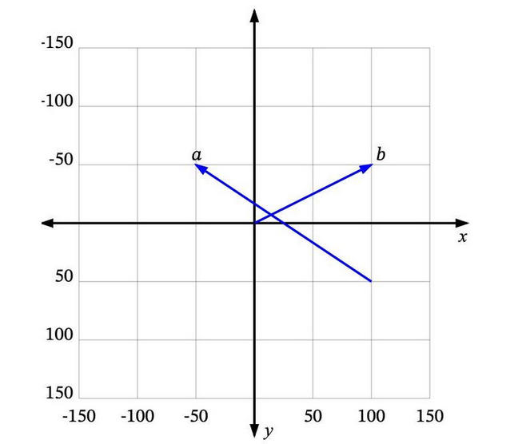

很多时候，我们处理的向量是从原点 (0, 0) 开始的，比如**b**。这样我们可以省略向量起点部分，直接说 **b** 是向量 (100, -50)。

如何将向量的概念扩展到非数值实体上呢（例如文本）？

#### 2.2、维度 Dimensions

如我们所见，每个数值向量都有 x 和 y 坐标（或者在多维系统中是 x、y、z，...）。x、y、z... 是这个向量空间的轴，称为维度。对于我们想要表示为向量的一些非数值实体，我们首先需要决定这些维度，并为每个实体在每个维度上分配一个值。

例如，在一个交通工具数据集中，我们可以定义四个维度：“轮子数量”、“是否有发动机”、“是否可以在地上开动”和“最大乘客数”。然后我们可以将一些车辆表示为：

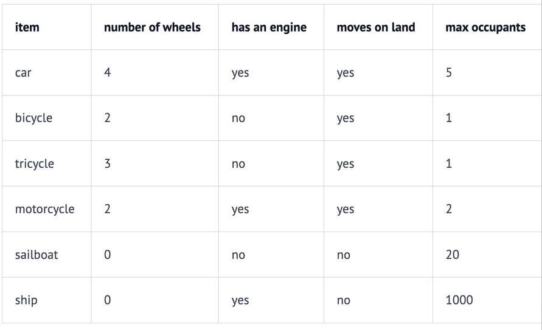

因此，我们的汽车Car向量将是 (4, yes, yes, 5)，或者用数值表示为 (4, 1, 1, 5)（将 yes 设为 1，no 设为 0）。

向量的每个维度代表数据的不同特性，维度越多对事务的描述越精确，我们可以使用“是否有翅膀”、“是否使用柴油”、“最高速度”、“平均重量”、“价格”等等更多的维度信息。


#### 2.3、相似度 Similarity

如果用户搜索`“轿车Car”`，你希望能够返回所有与`“汽车automobile”`和`“车辆vehicle”`等信息相关的结果。向量搜索就是实现这个目标的一种方法。

**如何确定哪些是最相似的？**

每个向量都有一个长度和方向。例如，在这个图中，p 和 a 指向相同的方向，但长度不同。p 和 b 正好指向相反的方向，但有相同的长度。然后还有c，长度比p短一点，方向不完全相同，但很接近。

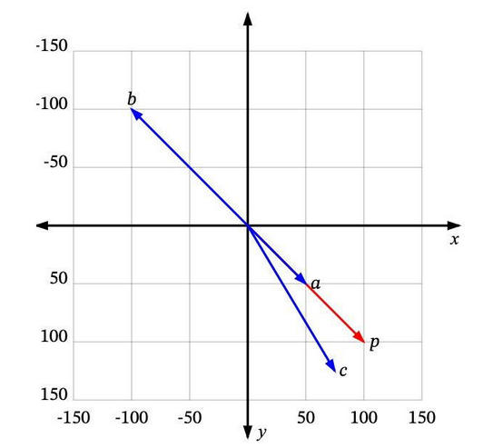

那么，哪一个最接近 p 呢？

如果“相似”仅仅意味着指向相似的方向，那么a 是最接近 p 的。接下来是 c。b 是最不相似的，因为它正好指向与p 相反的方向。如果“相似”仅仅意味着相似的长度，那么 b 是最接近 p 的（因为它有相同的长度），接下来是 c，然后是 a。

由于向量通常用于描述语义意义，仅仅看长度通常无法满足需求。**大多数相似度测量要么仅依赖于方向，要么同时考虑方向和大小。**

#### 2.4、相似度测量 Measures of similarity

相似度测量即相似度计算。四种常见的向量相似度计算方法（这里不展开讨论）：

- 欧几里得距离 Euclidean distance
- 曼哈顿距离 Manhattan distance
- 点积 Dot product
- 余弦相似度 Cosine similarity


### 3、RAG的过程

**RAG 过程分为 2 个不同的阶段：索引和检索。**

#### 3.1、索引阶段

 在索引阶段，对知识库文档进行预处理，可实现检索阶段的高效搜索。

- 以下是索引阶段的简化图：


加载知识库文档 ==> 将文档中的**文本分段** ==> 利用**向量大模型**将分段后的**文本转换成向量** ==> 将向量**存入向量数据库**

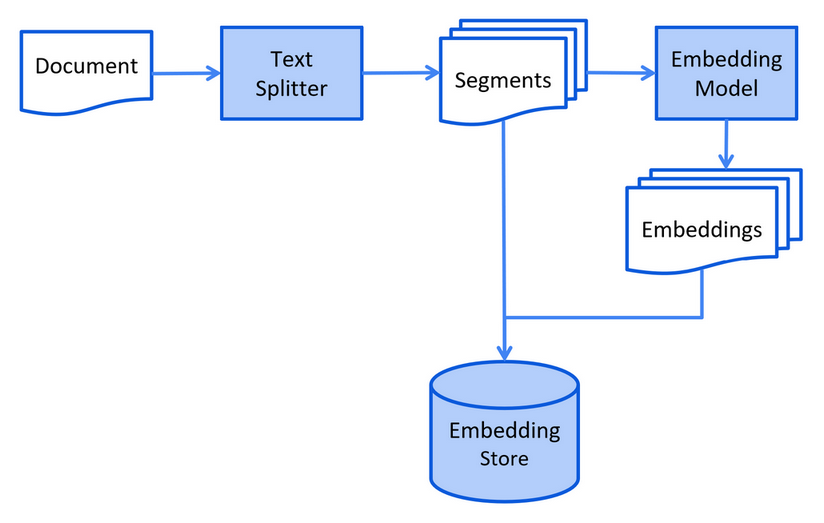

**为什么要进行文本分段？**

大语言模型（LLM）的上下文窗口有限，所以整个知识库可能无法全部容纳其中。

- 你在提问中提供的信息越多，大语言模型处理并做出回应所需的时间就越长。
- 你在提问中提供的信息越多，花费也就越多。
- 提问中的无关信息可能会干扰大语言模型，增加产生幻觉（生成错误信息）的几率。

我们可以通过将知识库分割成更小、更易于理解的片段来解决这些问题。


#### 3.2、检索阶段

- 以下是检索阶段的简化图：


通过向量模型**将用户查询转换成向量** ==> 在向量数据库中根据用户查询进行**相似度匹配** ==> 将用户查询和向量数据库中匹配到的相关内容一起交给LLM处理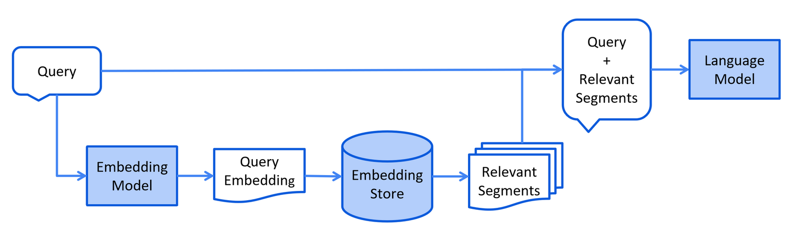

### 4、文档加载器 Document Loader

#### 4.1、常见文档加载器

- `来自 langchain4j 模块的文件系统文档加载器（FileSystemDocumentLoader）`
- 来自 langchain4j 模块的类路径文档加载器（ClassPathDocumentLoader）
- 来自 langchain4j 模块的网址文档加载器（UrlDocumentLoader）
- 来自 langchain4j-document-loader-amazon-s3 模块的亚马逊 S3 文档加载器（AmazonS3DocumentLoader）
- 来自 langchain4j-document-loader-azure-storage-blob 模块的 Azure Blob 存储文档加载器（AzureBlobStorageDocumentLoader）
- 来自 langchain4j-document-loader-github 模块的 GitHub 文档加载器（GitHubDocumentLoader）
- 来自 langchain4j-document-loader-google-cloud-storage 模块的谷歌云存储文档加载器（GoogleCloudStorageDocumentLoader）
- 来自 langchain4j-document-loader-selenium 模块的 Selenium 文档加载器（SeleniumDocumentLoader）
- 来自 langchain4j-document-loader-tencent-cos 模块的腾讯云对象存储文档加载器（TencentCosDocumentLoader）

#### 4.2、测试文档加载

```java
package com.atguigu.java.ai.langchain4j;

@SpringBootTest
public class RAGTest {

    @Test
    public void testReadDocument() {
        //使用FileSystemDocumentLoader读取指定目录下的知识库文档
        //并使用默认的文档解析器TextDocumentParser对文档进行解析
        Document document = FileSystemDocumentLoader.loadDocument("E:/knowledge/测试.txt");
        System.out.println(document.text());
    }
}
```

其他加载文档的方式

```java
// 加载单个文档
Document document = FileSystemDocumentLoader.loadDocument("E:/knowledge/file.txt", new TextDocumentParser());

// 从一个目录中加载所有文档
List<Document> documents = FileSystemDocumentLoader.loadDocuments("E:/knowledge", new TextDocumentParser());

// 从一个目录中加载所有的.txt文档
PathMatcher pathMatcher = FileSystems.getDefault().getPathMatcher("glob:*.txt");
List<Document> documents = FileSystemDocumentLoader.loadDocuments("E:/knowledge", pathMatcher, new TextDocumentParser());

// 从一个目录及其子目录中加载所有文档
List<Document> documents = FileSystemDocumentLoader.loadDocumentsRecursively("E:/knowledge", new TextDocumentParser());
```


### 5、文档解析器 Document Parser 

#### 5.1、常见文档解析器

文档可以是各种格式的文件，比如 PDF、DOC、TXT 等等。为了解析这些不同格式的文件，有一个 “文档解析器”（DocumentParser）接口，并且我们的库中包含了该接口的几种实现方式：

- `来自 langchain4j 模块的文本文档解析器（TextDocumentParser），它能够解析纯文本格式的文件（例如 TXT、HTML、MD 等）。`
- 来自 langchain4j-document-parser-apache-pdfbox 模块的 Apache PDFBox 文档解析器（ApachePdfBoxDocumentParser），它可以解析 PDF 文件。
- 来自 langchain4j-document-parser-apache-poi 模块的 Apache POI 文档解析器（ApachePoiDocumentParser），它能够解析微软办公软件的文件格式（例如 DOC、DOCX、PPT、PPTX、XLS、XLSX 等）。
- 来自 langchain4j-document-parser-apache-tika 模块的 Apache Tika 文档解析器（ApacheTikaDocumentParser），它可以自动检测并解析几乎所有现有的文件格式。


假设如果我们想解析PDF文档，那么原有的`TextDocumentParser`就无法工作了，我们需要引入`langchain4j-document-parser-apache-pdfbox`

#### 5.2、添加依赖

```xml
<!--解析pdf文档-->
<dependency>
    <groupId>dev.langchain4j</groupId>
    <artifactId>langchain4j-document-parser-apache-pdfbox</artifactId>
</dependency>
```

#### 5.3、解析pdf文档

```java
 /**
     * 解析PDF
     */
@Test
public void testParsePDF() {
    Document document = FileSystemDocumentLoader.loadDocument(
            "E:/knowledge/医院信息.pdf",
            new ApachePdfBoxDocumentParser()
    );
    System.out.println(document);
}
```


### 6、文档分割器 Document Splitter

#### 6.1、常见文档分割器

LangChain4j 有一个 “文档分割器”（DocumentSplitter）接口，并且提供了几种开箱即用的实现方式：

`按段落文档分割器（DocumentByParagraphSplitter）`

按行文档分割器（DocumentByLineSplitter）

按句子文档分割器（DocumentBySentenceSplitter）

按单词文档分割器（DocumentByWordSplitter）

按字符文档分割器（DocumentByCharacterSplitter）

按正则表达式文档分割器（DocumentByRegexSplitter）

递归分割：DocumentSplitters.recursive (...)

默认情况下每个文本片段最多不能超过300个token

#### 6.2、测试向量转换和向量存储

Embedding (Vector) Stores 常见的意思是 “嵌入（向量）存储” 。在机器学习和自然语言处理领域，Embedding 指的是将数据（如文本、图像等）转换为低维稠密向量表示的过程，这些向量能够保留数据的关键特征。而 Stores 表示存储，即用于存储这些嵌入向量的系统或工具。它们可以高效地存储和检索向量数据，支持向量相似性搜索，在文本检索、推荐系统、图像识别等任务中发挥着重要作用。

**Langchain4j支持的向量存储：**https://docs.langchain4j.dev/integrations/embedding-stores/

添加依赖：

```xml
<!--简单的rag实现-->
<dependency>
    <groupId>dev.langchain4j</groupId>
    <artifactId>langchain4j-easy-rag</artifactId>
</dependency>
```

测试：

```java
/**
 * 加载文档并存入向量数据库
 */
@Test
public void testReadDocumentAndStore() {

    //使用FileSystemDocumentLoader读取指定目录下的知识库文档
    //并使用默认的文档解析器对文档进行解析(TextDocumentParser)
    Document document = FileSystemDocumentLoader.loadDocument("E:/knowledge/人工智能.md");

    //为了简单起见，我们暂时使用基于内存的向量存储
    InMemoryEmbeddingStore<TextSegment> embeddingStore = new InMemoryEmbeddingStore<>();

    //ingest
    //1、分割文档：默认使用递归分割器，将文档分割为多个文本片段，每个片段包含不超过 300个token，并且有 30个token的重叠部分保证连贯性
    //DocumentByParagraphSplitter(DocumentByLineSplitter(DocumentBySentenceSplitter(DocumentByWordSplitter)))
    //2、文本向量化：使用一个LangChain4j内置的轻量化向量模型对每个文本片段进行向量化
    //3、将原始文本和向量存储到向量数据库中(InMemoryEmbeddingStore)
    EmbeddingStoreIngestor.ingest(document, embeddingStore);
    //查看向量数据库内容
    System.out.println(embeddingStore);
}
```


#### 6.3、测试文档分割

```java
/**
 * 文档分割
 */
@Test
public void testDocumentSplitter() {

    //使用FileSystemDocumentLoader读取指定目录下的知识库文档
    //并使用默认的文档解析器对文档进行解析(TextDocumentParser)
    Document document = FileSystemDocumentLoader.loadDocument("E:/knowledge/人工智能.md");

    //为了简单起见，我们暂时使用基于内存的向量存储
    InMemoryEmbeddingStore<TextSegment> embeddingStore = new InMemoryEmbeddingStore<>();

    //自定义文档分割器
    //按段落分割文档：每个片段包含不超过 300个token，并且有 30个token的重叠部分保证连贯性
    //注意：当段落长度总和小于设定的最大长度时，就不会有重叠的必要。
    DocumentByParagraphSplitter documentSplitter = new DocumentByParagraphSplitter(
            300,
            30,
            //token分词器：按token计算
            new HuggingFaceTokenizer());
    //按字符计算
    //DocumentByParagraphSplitter documentSplitter = new DocumentByParagraphSplitter(300, 30);

    EmbeddingStoreIngestor
            .builder()
            .embeddingStore(embeddingStore)
            .documentSplitter(documentSplitter)
            .build()
            .ingest(document);
}
```

#### 6.4、token和token计算

DeepSeek：[Token 用量计算 | DeepSeek API Docs](https://api-docs.deepseek.com/zh-cn/quick_start/token_usage)

阿里百炼：[百炼控制台](https://bailian.console.aliyun.com/?spm=5176.29597918.J_SEsSjsNv72yRuRFS2VknO.2.18867ca0uXrEFa#/efm/model_experience_center)

LangChain4j：

```java
@Test
public void testTokenCount() {
    String text = "这是一个示例文本，用于测试 token 长度的计算。";
    UserMessage userMessage = UserMessage.userMessage(text);

    //计算 token 长度
    //QwenTokenizer tokenizer = new QwenTokenizer(System.getenv("DASH_SCOPE_API_KEY"), "qwen-max");
    HuggingFaceTokenizer tokenizer = new HuggingFaceTokenizer();
    int count = tokenizer.estimateTokenCountInMessage(userMessage);
    System.out.println("token长度：" + count);
}
```

#### 6.5、工作方式

1. 实例化一个 “文档分割器”（DocumentSplitter），指定所需的 “文本片段”（TextSegment）大小，并且可以选择指定characters 或token的重叠部分。
2. “文档分割器”（DocumentSplitter）将给定的文档（Document）分割成更小的单元，这些单元的性质因分割器而异。例如，“按段落分割文档器”（DocumentByParagraphSplitter）将文档分割成段落（由两个或更多连续的换行符定义），而 “按句子分割文档器”（DocumentBySentenceSplitter）使用 OpenNLP 库的句子检测器将文档分割成句子，依此类推。
3. 然后，“文档分割器”（DocumentSplitter）将这些较小的单元（段落、句子、单词等）组合成 “文本片段”（TextSegment），尝试在单个 “文本片段”（TextSegment）中包含尽可能多的单元，同时不超过第一步中设置的限制。如果某些单元仍然太大，无法放入一个 “文本片段”（TextSegment）中，它会调用一个子分割器。这是另一个 “文档分割器”（DocumentSplitter），能够将不适合的单元分割成更细粒度的单元。会向每个文本片段添加一个唯一的元数据条目 “index”。第一个 “文本片段”（TextSegment）将包含 `index=0`，第二个是 `index=1`，依此类推


`模型上下文窗口`可以通过模型参数列表查看：[阿里云百炼](https://bailian.console.aliyun.com/?tab=doc#/doc/?type=model&url=https%3A%2F%2Fhelp.aliyun.com%2Fdocument_detail%2F2840914.html)

**期望的文本片段最大大小**

1. **模型上下文窗口**：如果你使用的大语言模型（LLM）有特定的上下文窗口限制，这个值不能超过模型能够处理的最大 token 数。例如，某些模型可能最大只能处理 2048 个 token，那么设置的文本片段大小就需要远小于这个值，为后续的处理（如添加指令、其他输入等）留出空间。通常，在这种情况下，你可以设置为 1000 - 1500 左右，具体根据实际情况调整。
2. **数据特点**：如果你的文档内容较为复杂，每个段落包含的信息较多，那么可以适当提高这个值，比如设置为 500 - 800 个 token，以便在一个文本片段中包含相对完整的信息块。相反，如果文档段落较短且信息相对独立，设置为 200 - 400 个 token 可能就足够了。
3. **检索需求**：如果希望在检索时能够更精确地匹配到相关信息，较小的文本片段可能更合适，这样可以提高信息的粒度。例如设置为 200 - 300 个 token。但如果更注重获取完整的上下文信息，较大的文本片段（如 500 - 600 个 token）可能更有助于理解相关内容。

**重叠部分大小**

1. **上下文连贯性**：重叠部分的主要作用是提供上下文连贯性，避免因分割导致信息缺失。如果文档内容之间的逻辑联系紧密，建议设置较大的重叠部分，如 50 - 100 个 token，以确保相邻文本片段之间的过渡自然，模型在处理时能够更好地理解上下文。
2. **数据冗余**：然而，设置过大的重叠部分会增加数据的冗余度，可能导致处理时间增加和资源浪费。因此，需要在上下文连贯性和数据冗余之间进行平衡。一般来说，20 - 50 个 token 的重叠是比较常见的取值范围。
3. **模型处理能力**：如果使用的模型对输入的敏感性较高，较小的重叠部分（如 20 - 30 个 token）可能就足够了，因为过多的重叠可能会引入不必要的干扰信息。但如果模型对上下文依赖较大，适当增加重叠部分（如 40 - 60 个 token）可能会提高模型的性能。

例如，在处理一般性的文本资料，且使用的模型上下文窗口较大（如 4096 个 token）时，设置文本片段最大大小为 600 - 800 个 token，重叠部分为 30 - 50 个 token 可能是一个不错的选择。但最终的设置还需要通过实验和实际效果评估来确定，以找到最适合具体应用场景的参数值。


## 十一、项目实战-在硅谷小智中实现RAG

### 1、创建@Bean对象

在xiaozhiAgentConfig中添加ContentRetriever

```java
@Bean
ContentRetriever contentRetrieverXiaozhi() {
    //使用FileSystemDocumentLoader读取指定目录下的知识库文档
    //并使用默认的文档解析器对文档进行解析
    Document document1 = FileSystemDocumentLoader.loadDocument("E:/knowledge/医院信息.md");
    Document document2 = FileSystemDocumentLoader.loadDocument("E:/knowledge/科室信息.md");
    Document document3 = FileSystemDocumentLoader.loadDocument("E:/knowledge/神经内科.md");
    List<Document> documents = Arrays.asList(document1, document2, document3);

    //使用内存向量存储
    InMemoryEmbeddingStore<TextSegment> embeddingStore = new InMemoryEmbeddingStore<>();
    //使用默认的文档分割器
    EmbeddingStoreIngestor.ingest(documents, embeddingStore);

    //从嵌入存储（EmbeddingStore）里检索和查询内容相关的信息
    return EmbeddingStoreContentRetriever.from(embeddingStore);

}
```


### 2、添加配置

在`XiaozhiAgent`中添加`contentRetriever`配置

```java
@AiService(
        wiringMode = EXPLICIT,
        chatModel = "qwenChatModel",
        chatMemoryProvider = "chatMemoryProviderXiaozhi",
        tools = "appointmentTools",
        contentRetriever = "contentRetrieverXiaozhi" //配置向量存储
)
```


### 3、修改工具的value提示

```java
@Tool(name="预约挂号", value = "根据参数，先执行工具方法queryDepartment查询是否可预约，并直接给用户回答是否可预约，并让用户确认所有预约信息，用户确认后再进行预约。如果用户没有提供具体的医生姓名，请从向量存储中找到一位医生。")
```


### 4、测试RAG

在Controller中测试


## 十二、向量模型和向量存储

### 1、向量大模型

#### 1.1、介绍

**通用文本向量模型：**https://help.aliyun.com/zh/model-studio/developer-reference/text-embedding-synchronous-api?spm=a2c4g.11186623.help-menu-2400256.d_2_5_0.592672a3yMJDRq&scm=20140722.H_2712515._.OR_help-T_cn~zh-V_1

**text-embedding-v3：**[阿里云百炼](https://bailian.console.aliyun.com/?tab=model#/model-market/detail/text-embedding-v3)

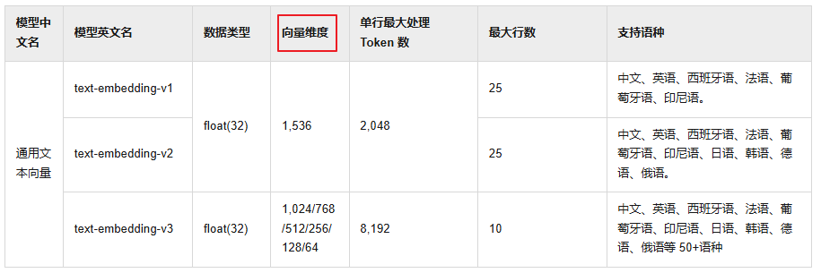

使用通用文本向量 text-embedding-v3，维度1024，维度越多，对事务的描述越精准，信息检索的精度越高


#### 1.2、模型配置

使用`text-embedding-v3`依然需要添加`langchain4j-community-dashscope`依赖，我们之前已经添加过了

配置向量模型

```properties
#集成阿里通义千问-通用文本向量-v3
langchain4j.community.dashscope.embedding-model.api-key=${DASH_SCOPE_API_KEY}
langchain4j.community.dashscope.embedding-model.model-name=text-embedding-v3
```

#### 1.3、文本向量化

```java
package com.atguigu.java.ai.langchain4j;

@SpringBootTest
public class EmbeddingTest {

    @Autowired
    private EmbeddingModel embeddingModel;

    @Test
    public void testEmbeddingModel(){
        Response<Embedding> embed = embeddingModel.embed("你好");

        System.out.println("向量维度：" + embed.content().vector().length);
        System.out.println("向量输出：" + embed.toString());
    }
}
```


### 2、向量存储

#### 2.1、Pinecone简介

之前我们使用的是InMemoryEmbeddingStore作为向量存储，但是不建议在生产中使用基于内存的向量存储。因此这里我们使用Pinecone作为向量数据库。

官方网站：[The vector database to build knowledgeable AI | Pinecone](https://www.pinecone.io/)

访问官方网站、注册、登录、获取apiKey且配置在环境变量中。**默认有2GB的免费存储空间**


#### 2.2、Pinecone的使用

**得分的含义**

在向量检索场景中，当我们把查询文本转换为向量后，会在嵌入存储（`EmbeddingStore`）里查找与之最相似的向量（这些向量对应着文档片段等内容）。为了衡量查询向量和存储向量之间的相似程度，会使用某种相似度计算方法（例如余弦相似度等）来得出一个数值，这个数值就是得分。得分越高，表明查询向量和存储向量越相似，对应的文档片段与查询文本的相关性也就越高。

**得分的作用**

- **筛选结果**：通过设置 `minScore` 阈值，能够过滤掉那些与查询文本相关性较低的结果。在代码里，`minScore(0.8)` 意味着只有得分大于等于 0.8 的结果才会被返回，低于这个阈值的结果会被舍弃。这样可以确保返回的结果是与查询文本高度相关的，提升检索结果的质量。
- **控制召回率和准确率**：调整 `minScore` 的值可以在召回率和准确率之间进行权衡。如果把阈值设置得较低，那么更多的结果会被返回，召回率会提高，但可能会包含一些相关性不太强的结果，导致准确率下降；反之，如果把阈值设置得较高，返回的结果数量会减少，准确率会提高，但可能会遗漏一些相关的结果，使得召回率降低。在实际应用中，需要根据具体的业务需求来合理设置 `minScore` 的值。

**示例说明**

假设我们有一个关于水果的文档集合，嵌入存储中存储了这些文档片段的向量。当我们使用 “苹果的营养价值” 作为查询文本时，向量检索会计算查询向量与存储向量的相似度得分。如果 `minScore` 设置为 0.8，那么只有那些与 “苹果的营养价值” 相关性非常高的文档片段才会被返回，而一些只简单提及苹果但没有详细讨论其营养价值的文档片段可能由于得分低于 0.8 而不会被返回。


#### 2.3、集成Pinecone

参考文档：[Pinecone | LangChain4j](https://docs.langchain4j.dev/integrations/embedding-stores/pinecone)

添加依赖：

```xml
<dependency>
    <groupId>dev.langchain4j</groupId>
    <artifactId>langchain4j-pinecone</artifactId>
</dependency>
```


#### 2.4、配置向量存储对象

```java
package com.atguigu.java.ai.langchain4j.config;

@Configuration
public class EmbeddingStoreConfig {

    @Autowired
    private EmbeddingModel embeddingModel;

    @Bean
    public EmbeddingStore<TextSegment> embeddingStore() {
        //创建向量存储
        EmbeddingStore<TextSegment> embeddingStore = PineconeEmbeddingStore.builder()
                .apiKey(System.getenv("PINECONE_API_KEY"))
                .index("xiaozhi-index")//如果指定的索引不存在，将创建一个新的索引
                .nameSpace("xiaozhi-namespace") //如果指定的名称空间不存在，将创建一个新的名称空间
                .createIndex(PineconeServerlessIndexConfig.builder()
                        .cloud("AWS") //指定索引部署在 AWS 云服务上。
                        .region("us-east-1") //指定索引所在的 AWS 区域为 us-east-1。
                        .dimension(embeddingModel.dimension()) //指定索引的向量维度，该维度与 embeddedModel 生成的向量维度相同。
                        .build())
                .build();

        return embeddingStore;
    }
}
```


#### 2.5、测试向量存储

```java
@Autowired
private EmbeddingStore embeddingStore;

/**
 * 将文本转换成向量，然后存储到pinecone中
 *
 * 参考：
 * https://docs.langchain4j.dev/tutorials/embedding-stores
 */
@Test
public void testPineconeEmbeded() {

    //将文本转换成向量
    TextSegment segment1 = TextSegment.from("我喜欢羽毛球");
    Embedding embedding1 = embeddingModel.embed(segment1).content();
    //存入向量数据库
    embeddingStore.add(embedding1, segment1);

    TextSegment segment2 = TextSegment.from("今天天气很好");
    Embedding embedding2 = embeddingModel.embed(segment2).content();
    embeddingStore.add(embedding2, segment2);
}
```


### 3、相似度匹配

接收请求获取问题，将问题转换为向量，在 Pinecone 向量数据库中进行相似度搜索，找到最相似的文本片段，并将其文本内容返回给客户端。

```java
/**
 * Pinecone-相似度匹配
 */
@Test
public void embeddingSearch() {

    //提问，并将问题转成向量数据
    Embedding queryEmbedding = embeddingModel.embed("你最喜欢的运动是什么？").content();
    //创建搜索请求对象
    EmbeddingSearchRequest searchRequest = EmbeddingSearchRequest.builder()
            .queryEmbedding(queryEmbedding)
            .maxResults(1) //匹配最相似的一条记录
        	//.minScore(0.8)
            .build();

    //根据搜索请求 searchRequest 在向量存储中进行相似度搜索
    EmbeddingSearchResult<TextSegment> searchResult = embeddingStore.search(searchRequest);

    //searchResult.matches()：获取搜索结果中的匹配项列表。
    //.get(0)：从匹配项列表中获取第一个匹配项
    EmbeddingMatch<TextSegment> embeddingMatch = searchResult.matches().get(0);

    //获取匹配项的相似度得分
    System.out.println(embeddingMatch.score()); // 0.8144288515898701

    //返回文本结果
    System.out.println(embeddingMatch.embedded().text());
}
```


## 十三、项目实战-在硅谷小智中整合向量数据库

### 1、上传知识库到Pinecone

```java
@Test
public void testUploadKnowledgeLibrary() {

    //使用FileSystemDocumentLoader读取指定目录下的知识库文档
    //并使用默认的文档解析器对文档进行解析
    Document document1 = FileSystemDocumentLoader.loadDocument("E:/knowledge/医院信息.md");
    Document document2 = FileSystemDocumentLoader.loadDocument("E:/knowledge/科室信息.md");
    Document document3 = FileSystemDocumentLoader.loadDocument("E:/knowledge/神经内科.md");
    List<Document> documents = Arrays.asList(document1, document2, document3);

    //文本向量化并存入向量数据库：将每个片段进行向量化，得到一个嵌入向量
    EmbeddingStoreIngestor
            .builder()
            .embeddingStore(embeddingStore)
            .embeddingModel(embeddingModel)
            .build()
            .ingest(documents);
}
```

### 2、修改XiaozhiAgentConfig

添加基于Pinecone的向量数据库配置

```java
@Autowired
private EmbeddingStore embeddingStore;

@Autowired
private EmbeddingModel embeddingModel;

@Bean
ContentRetriever contentRetrieverXiaozhiPincone() {

    // 创建一个 EmbeddingStoreContentRetriever 对象，用于从嵌入存储中检索内容
    return EmbeddingStoreContentRetriever
            .builder()
            // 设置用于生成嵌入向量的嵌入模型
            .embeddingModel(embeddingModel)
            // 指定要使用的嵌入存储
            .embeddingStore(embeddingStore)
            // 设置最大检索结果数量，这里表示最多返回 1 条匹配结果
            .maxResults(1)
            // 设置最小得分阈值，只有得分大于等于 0.8 的结果才会被返回
            .minScore(0.8)
            // 构建最终的 EmbeddingStoreContentRetriever 实例
            .build();
}
```

### 3、修改XiaozhiAgent

修改contentRetriever的配置为contentRetrieverXiaozhiPincone

```java
@AiService(
        wiringMode = EXPLICIT,
        chatModel = "qwenChatModel",
        chatMemoryProvider = "chatMemoryProviderXiaozhi",
        tools = "appointmentTools",
        contentRetriever = "contentRetrieverXiaozhiPincone")
```


## 十四、项目实战-改造流式输出

大模型的流式输出是指大模型在生成文本或其他类型的数据时，不是等到整个生成过程完成后再一次性返回所有内容，而是生成一部分就立即发送一部分给用户或下游系统，以逐步、逐块的方式返回结果。这样，用户就不需要等待整个文本生成完成再看到结果。通过这种方式可以改善用户体验，因为用户不需要等待太长时间，几乎可以立即开始阅读响应。

### 1、添加依赖

```xml
<!--流式输出-->
<dependency>
    <groupId>org.springframework.boot</groupId>
    <artifactId>spring-boot-starter-webflux</artifactId>
</dependency>
<dependency>
    <groupId>dev.langchain4j</groupId>
    <artifactId>langchain4j-reactor</artifactId>
</dependency>
```

### 2、配置流式输出模型

在application.properties中配置流式输出大模型

```properties
#集成阿里通义千问-流式输出
langchain4j.community.dashscope.streaming-chat-model.api-key=${DASH_SCOPE_API_KEY}
langchain4j.community.dashscope.streaming-chat-model.model-name=qwen-plus
```

### 3、编码

修改`XiaozhiAgent`中`chatModel`改为 streamingChatModel = "qwenStreamingChatModel"

``chat`方法的返回值为`Flux<String>`

```java
@AiService(
        wiringMode = EXPLICIT,
        streamingChatModel = "qwenStreamingChatModel",
        chatMemoryProvider = "chatMemoryProviderXiaozhi",
        tools = "appointmentTools",
        contentRetriever = "contentRetrieverXiaozhiPincone")
public interface XiaozhiAgent {

    @SystemMessage(fromResource = "zhaozhi-prompt-template.txt")
    Flux<String> chat(@MemoryId Long memoryId, @UserMessage String userMessage);
}
```

修改`XiaozhiController`中`chat`方法的返回值为`Flux<String>`，并添加`produces`属性

```java
@Operation(summary = "对话")
@PostMapping(value = "/chat", produces = "text/stream;charset=utf-8")
public Flux<String> chat(@RequestBody ChatForm chatForm)  {
    return xiaozhiAgent.chat(chatForm.getMemoryId(), chatForm.getMessage());
}
```

### 3、测试


## 十五、项目实战-运行前端工程

### 1、安装Node.js

Node.js是一个基于JavaScript引擎的服务器端环境，前端项目在开发环境下要基于Node.js来运行

安装：node-v18.17.1-x64.msi


### 2、配置npm镜像

打开命令行，配置依赖的下载使用阿里镜像

```bash
npm config set registry https://registry.npmmirror.com
```


### 3、运行前端项目

进入项目目录，执行下面的命令启动项目：

```powershell
cd xiaozhi-ui
npm i
npm run dev
```


